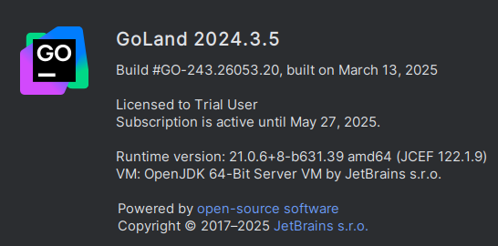

### Description
This is a trial reset tool that can reset the trial period of any JetBrains IDE. It aims to only reset the trial period,
and to not delete any of your settings, or license keys that you may have, unlike other tools that are available.




### Requirements
- Supported os: Linux (for now)
- Supported IDEs:
  - JetBrains IDEs (e.g., PyCharm, IntelliJ IDEA, etc.)

### Usage
- Download the binary from the Releases page.
- Open up a terminal, cd into the directory where you downloaded the binary.
  ```bash
    cd ~/Downloads
  ```
- Make it executable:
  ```bash
  chmod +x trial-reset-linux-x64.elf
  ```
- Exit any JetBrains IDEs that are running. Witout this it will not work!!!!
- Run the binary:
  ```bash
    ./trial-reset-linux-x64.elf
    ```
- Accept the prompt that appears.
- That is it!

If you have problems refer to the contact session.

### Contact
If you have trouble using the software, or your trial is not properly reset, please contact me [Session messenger](https://getsession.org/download).
- 054573102fd6159e4064a974062c86d3f854d064d81314a6ca949e67a203f5610e

### FAQ
- **Q: How does it work?**
  - A: I will not disclose this. JetBrains is known to scan for GitHub repositories that contain this information,
    and then submitting a DMCA request to take it down. If you really want to know, you have to reverse engineer it.
    - See also: [JetBrains DMCA takedown](https://github.com/github/dmca/blob/master/2022/04/2022-04-13-jetbrains.md)

- **Q: Is it safe to use?**
  - A: Yes, the software does not need root and does not need the internet. However, be reminded that this may change due to  
    the way JetBrains implements their trial system in the future.
    - See also: [VirusTotal (0 detects)](https://www.virustotal.com/gui/file/3908999dac8596e4793e72c18b4e102e40f787c4cd17987ac81087dab1bb57f4?nocache=1)

- **Q: Is the operating system x supported?**
  - A: Currently, only Linux is supported. However, I plan to add Windows and macOS support in the future.
 
- **Q: If have x problem**
   - A: Refer to the contact section to contact the developer for trouble shooting.
     
- **Q: Why is the elf UPX packed?**
  - A: This is done so the binary is smaller, and thus faster to download for the poeple who have slower internet connection.

- **Q**: Can u upload the tool to x online file uploader?
  - A: If users wish to download the reset tool from other sources, such as DropBox, Gofile and so on, contact me and we shall see what i can do about it.
 
### DISCLAIMER:

This software is provided as-is, and the creator assumes no responsibility for how it is used.
Any actions taken with this software are the sole responsibility of the user.
The creator disclaims all liability for any misuse, damages, or legal consequences that may result from its use.

By choosing to use this software, you accept full accountability for your actions and acknowledge that the creator
cannot be held responsible for any accusations, issues, or outcomes arising from its use.

Use this software at your own risk.
